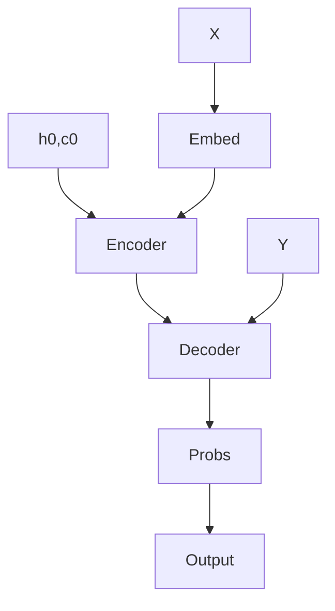

# Sequence-to-Sequence Model for Text Generation

This repository contains a PyTorch implementation of a sequence-to-sequence model for text generation especially for generation of sports(football) commentary from numerical input. 
The model is trained on football commentary from european leagues.

## Table of Contents
- Introduction
- Setup
- Model
- Preprocessing
- Training
- Results


## Introduction:
Disclaimer: The model was built and trained with a low-end setup due to which the hyperparameters chosen are small and the model architecture has been simplified along with utilizing a small subset of data.
I  have trained the code on Google Colab GPU which has a 15GB limit and all the choices have been made to encompass this.
The provided code implements a sequence-to-sequence model using RNNs(Recurrent Neural Networks). The model consists of an encoder-decoder structure , where the encoder processes the input event types
and the decoder generates the corresponding output sequences. 
The Old Model is actually  built using GRU(Gated Recurrent Unit) cells instead of RNNs for better performance ( no vanishing gradients ) and LSTM(Long Short Term Memory) for reduced computation and memory usage
as LSTMS do suffer from memory leaks. The latest model was built using LSTM's and a pre-trained gpt2 model which was fine-tuned for the specific task.
Model Architecture: 

Various techniques like Gradient Scaling, Gradient Checkpointing, Gradient Clipping , Half-Precision Float etc have been tried and implemented inorder to increase the efficiency.
Text has been embedded on a word level here rather than on a character level because the model was going to use minimal amount of data and training loops.The model will perform significantly better if 
trained on characters and more learning. Pre-trained word embeddding like Word2vec from gensim has been tried but the embedding layers from torch.nn with learnable parameters perform better. Use of 
Linear layers has been minimised inorder to simplify the model but the additional parameters will help in learning.

## Setup
To run the project: 

1.Install Python dependencies:
`pip install torch pandas numpy scikit-learn pathlib adapters transformers`

2.Clone the repository:
`git clone https://github.com/eshan1347/LSTM_sportsCommentary`

3.Download the dataset (for further training):

4.Train the model:
`python seq2seqTrain.py -bs batch_size -lr learning_rate -e epochs -ev evaluation_epochs`

5.Run the model
`python app.py`

## Model
The Encoder model is a custom pytorch model which consists of an initial embedding layer, which creates an embedding that is suitable for the gpt2, followed by a multi-layer perceptron. Then a LSTM layer is
present which is then fed into a self-attention layer with 8 n_heads. The Query is used from the current timestamp and the Keys and Values are used from all the previous timestamps. The attention layer allows 
the model to remember and focus on the important elements which the LSTM may have forgotten and cannot recover since it's a unidirectional one. The LSTM and attention outputs are combined and passed through 
another multi-layer perceptron. The logits and the combined LSTM and attention states are returned. The decoder consists of the gpt2 model on which an LoRA (Low Rank Adapter) is loaded inorder to simplify as 
well as speed up the learning process while still retaining the pretrained information. The logits and the encoder hidden states are fed into the gpt2 model to get the final output.


## Preprocessing 
The dataset used is huge with dimensions: (941009, 22). Only 200000 entries and 9 features were utilised for the model. This was done based on whether the features were relevent and missing values. The 
features selected have no null values. The numerical values were converted into strings based on their class names and what they denoted. Then the values were tokenised and encoded by the GPT2 Tokeniser 
and fed into the model. Also the data points where the target length is the median was chosen as to reduce the negative effect of padding and truncation on the learning.

## Training
A typical PyTorch training loop is ran with AdamW optimizer and a Cross-Entropy Loss function .Hyperparameter was performed using optuna to obtain hyperparameters like learning rate , dropout as well as 
optimal model variables like batch size , hiddem size etc. Various other optmizers and loss functions have been tried and tested including uncomman ones like Hessian-Free etc,But these are best suited. 
Inorder to view the various different approaches (Atleast a dozen !) taken inorder to maximize the learning, take a look at the LSTM_sportsComm.ipynb notebook provided.This notebook serves as a reminder 
of the various time, effort and strategies utilized while working on this project. Different approaches include using different adapters like prefix-tuning etc as well as using the gpt2 decoder with 
input_ids as well as seperately training the encoder and decoder. 

## Results
The model runs as expected and I achieved these loss values:
```
Epochs: 0 | Train Loss : 0.0171674732118845 | Val Loss : 0.011329622007906437
Epochs: 500 | Train Loss : 4.196323394775391 | Val Loss : 3.0318105220794678
Epochs: 1000 | Train Loss : 2.309067726135254 | Val Loss : 1.0371426343917847
Epochs: 1500 | Train Loss : 2.108802318572998 | Val Loss : 0.8397212028503418
Epochs: 2000 | Train Loss : 2.049696445465088 | Val Loss : 0.7620612978935242
Epochs: 2500 | Train Loss : 1.9995813369750977 | Val Loss : 0.7142027616500854
Epochs: 3000 | Train Loss : 1.9723531007766724 | Val Loss : 0.662489116191864
Epochs: 3500 | Train Loss : 1.9151420593261719 | Val Loss : 0.6189704537391663
Epochs: 4000 | Train Loss : 1.8971811532974243 | Val Loss : 0.5856496691703796
```
The model learning can be improved by training for more epochs as well as utilising the entire dataset as well as additional data. Also choosing a better decoder than the gpt2 will help. Even choosing a 
higher parameter version will bring improvemnts. 
